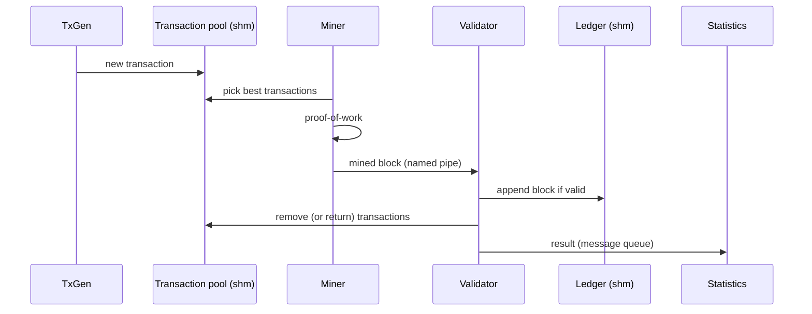

# DEIChain Blockchain Simulation

A concurrency-focused blockchain simulation in C: miners compete with proof-of-work, validators check and append blocks to a shared ledger, and a transaction generator feeds the system. Processes and threads cooperate through shared memory, semaphores, mutexes, a named pipe and a message queue.

University project for the *Sistemas Operativos* (Operating Systems) course, Computer Engineering (LEI), University of Coimbra.

## Features

- Shared transaction pool and shared ledger (System V shared memory)
- Multi-threaded miners with SHA-256 proof-of-work (difficulty depends on the transaction reward)
- Dynamic number of validator processes (1 to 3), scaled with the transaction pool occupancy
- Statistics process fed through a message queue, printed on `SIGUSR1` and on shutdown
- Timestamped log of every component
- Graceful shutdown on `SIGINT`, cleaning up all IPC resources

## Architecture

| Component | Kind | Role |
|---|---|---|
| Controller | main process | Reads `config.cfg`, creates the IPC resources, spawns the other processes and handles `SIGINT` |
| Miner | process, one thread per miner | Picks the most rewarding transactions from the pool, runs proof-of-work and sends the block to the validator |
| Validator | 1 to 3 processes | Verifies PoW, hash, duplicated transactions and the hash chain, then appends the block to the ledger |
| Validator manager | controller thread | Spawns or kills validators depending on the pool usage |
| Statistics | process | Collects per-miner results and average verification time |
| TxGen (`txgen`) | separate program | Generates random transactions into the shared pool |

Communication:

| Mechanism | Used for |
|---|---|
| Shared memory (`TransactionPool`) | Pending transactions, shared by TxGen, miners and validators |
| Shared memory (`Blockchain`) | Ledger of validated blocks |
| Named pipe (`/tmp/VALIDATOR_PIPE`) | Miners send mined blocks to the validators |
| Message queue | Validators report block results to the Statistics process |
| Signals | `SIGINT` shutdown, `SIGTERM` to child processes, `SIGUSR1` to print statistics |

### Synchronization

- Process-shared POSIX semaphores protect the transaction pool, the ledger, the configuration and the log file
- A mutex serializes miner writes to the pipe
- Mutexes protect the shutdown flags shared with the controller threads

### Data flow



## Tech Stack

C (GCC) · POSIX threads · System V IPC · POSIX semaphores · OpenSSL (`libcrypto`, SHA-256)

## Getting Started

### Prerequisites

- Linux
- GCC and `make`
- OpenSSL development headers (`libssl-dev` on Debian/Ubuntu)

### Installation

```bash
make
```

This builds two executables: `SO` (the simulation) and `txgen` (the transaction generator).

### Configuration

`config.cfg` uses the format `KEY - value`:

| Key | Meaning |
|---|---|
| `NUM_MINERS` | Number of miner threads |
| `TRANSACTIONS_PER_BLOCK` | Transactions in each block |
| `BLOCKCHAIN_BLOCKS` | Maximum number of blocks in the ledger |
| `TX_POOL_SIZE` | Capacity of the transaction pool |

### Usage

Start the simulation (it reads `config.cfg` from the current directory):

```bash
./SO
```

In another terminal, start one or more generators with a reward (1 to 3) and a sleep time between transactions in ms (200 to 3000):

```bash
./txgen 1 500
```

Print the current statistics with `SIGUSR1` sent to the Statistics process (its PID is written to the log), and stop everything with `Ctrl+C` in the `SO` terminal.

Everything is logged to `DEIChain_log.txt`.

## Authors

Francisco Teixeira, Simão Botas · University of Coimbra · Computer Engineering · 2025
